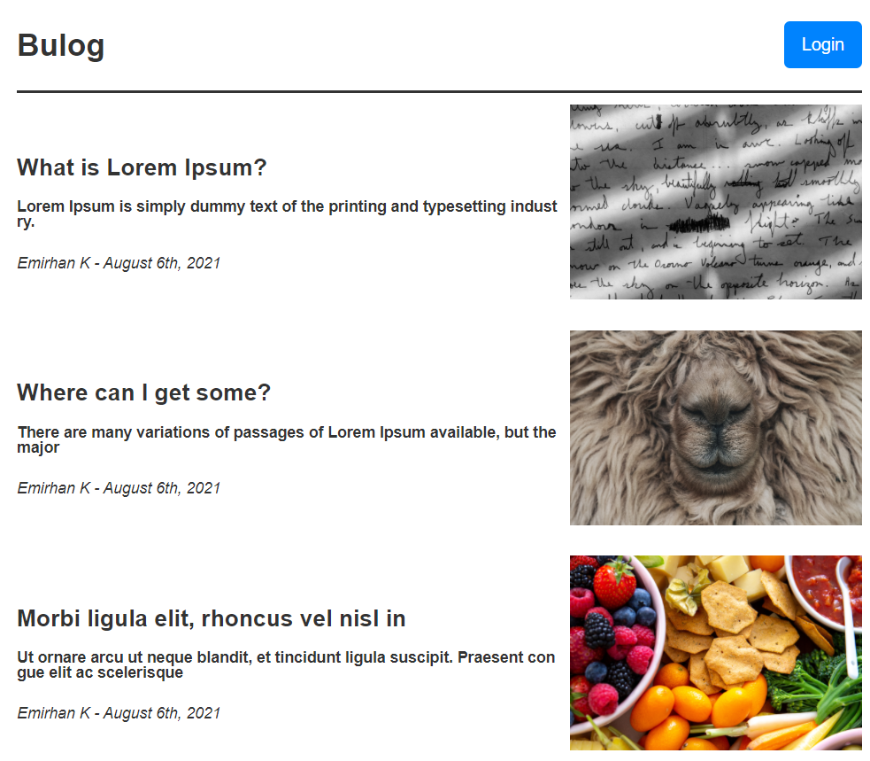
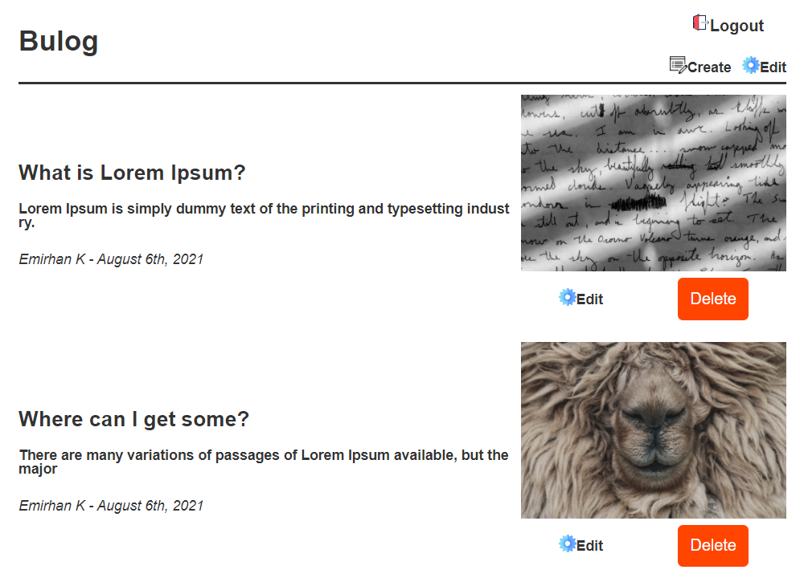
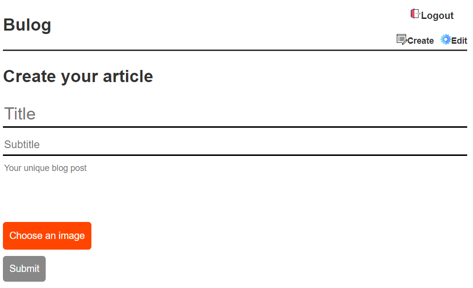
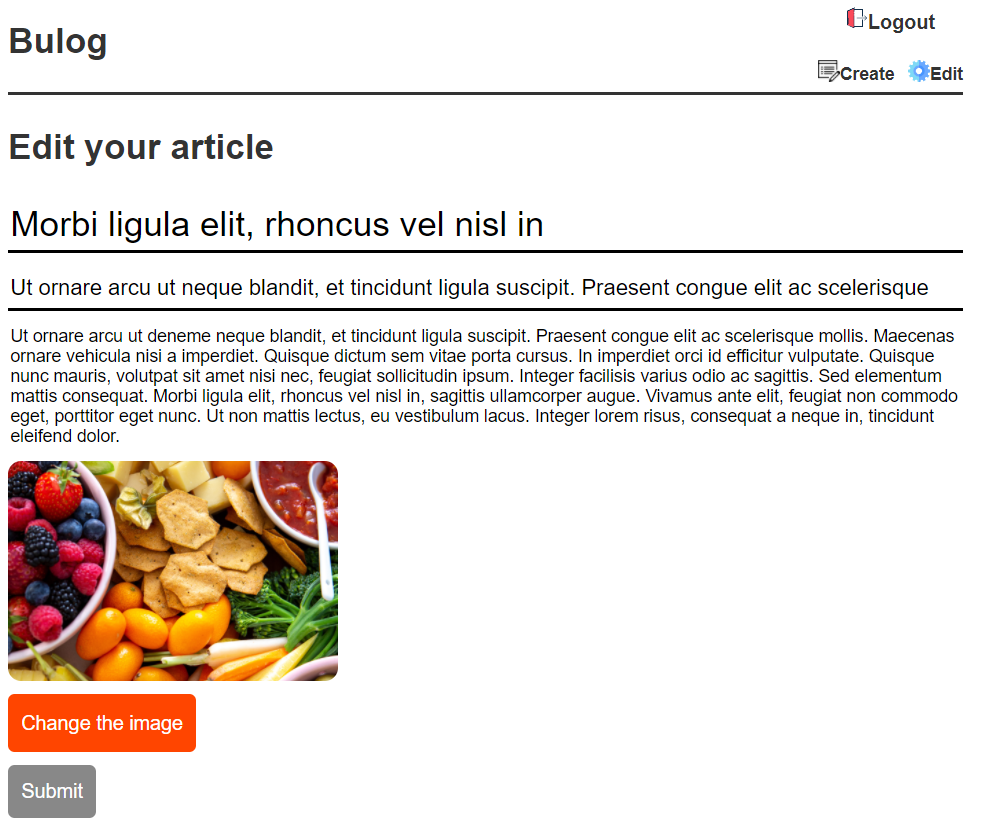

# Bulog
bulog is a minimalistic blog app, made using react, redux and firebase.

## Install

 1. Create **.env.development** file and fill it with your firebase config.
 ex: FIREBASE_API_KEY=XYZ
 
 then,
 
    $ yarn install

    $ yarn dev

## Test

 1. Create **.env.test** file and fill it with your firebase-test config.
 ex: FIREBASE_API_KEY=ZYX
 
  then,
    
     $ yarn test
     
## View

   
